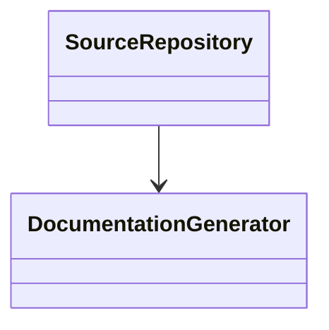
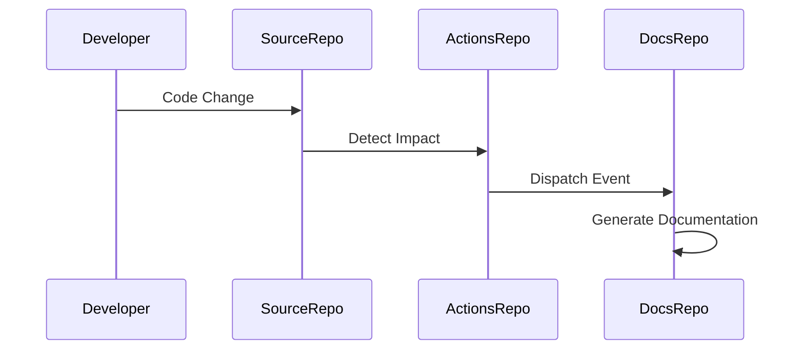

# Low-Level Design (LLD): greenfield-network

**Author**: Jijeesh Valappil
**Date**: 2026-07-12
**Version**: 1.0

**Source Repository**: `jijeeshlab/greenfield-code`
**Source PR Number**: `7`
**Source PR Title**: Update deploy.py

---

# 1. Introduction

## 1.1 Overview

This document describes the low-level implementation architecture generated from source code changes.

---

# 2. Detailed Design

## 2.1 Class Diagram

## 2.2 Sequence Diagram

## 2.3 Component Breakdown

### Source File: `src/deploy.py`

#### Function: `provision_zero_trust_network`

**Description:** Provisions isolated platform network boundaries
with NSX-T Distributed Firewall enforcement.

Args:
    vpc_cidr (str):
        The primary IP block schema allocation
        (e.g. 10.0.0.0/16).

Returns:
    bool:
        True if successful.

**Parameters:** vpc_cidr

**Returns:** bool

#### Function: `validate_network_segmentation`

**Description:** Validates network segmentation policies
before deployment.

Args:
    segment_name (str):
        Network segment name.

Returns:
    bool:
        Validation result.

**Parameters:** segment_name

**Returns:** bool

#### Function: `deploy_application_load_balancer`

**Description:** Deploys a software-defined load balancer.

Args:
    lb_name (str):
        Load balancer name.

    vip_address (str):
        Virtual IP address.

Returns:
    dict:
        Deployment result.

**Parameters:** lb_name, vip_address

**Returns:** dict

#### Function: `deploy_private_dns_zone`

**Description:** Deploys private DNS zone
for internal cloud services.

**Parameters:** zone_name

**Returns:** dict

#### Function: `deploy_vpn_gateway`

**Description:** Deploys VPN gateway service
for hybrid cloud connectivity.

**Parameters:** gateway_name, public_ip

**Returns:** dict

#### Function: `deploy_storage_gateway`

**Description:** Deploys storage gateway service
for cloud storage connectivity.

Args:
    gateway_name (str):
        Name of storage gateway.

    storage_pool (str):
        Backend storage pool.

Returns:
    dict:
        Deployment result.

**Parameters:** gateway_name, storage_pool

**Returns:** dict

---

# 3. Function Inventory

- `provision_zero_trust_network()`
- `validate_network_segmentation()`
- `deploy_application_load_balancer()`
- `deploy_private_dns_zone()`
- `deploy_vpn_gateway()`
- `deploy_storage_gateway()`

---

# 4. Error Handling

- Input validation
- Logging
- Exception handling

---

# 5. Security Considerations

- GitHub Secrets used for authentication
- Token values must never be logged
- Review generated documentation before publication

---

# 6. Changed Files

- src/deploy.py

---

# 7. Open Questions

- Additional business rules required?
- Additional architectural requirements required?
