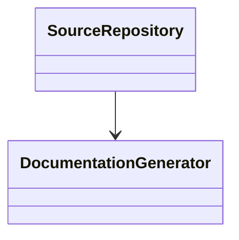
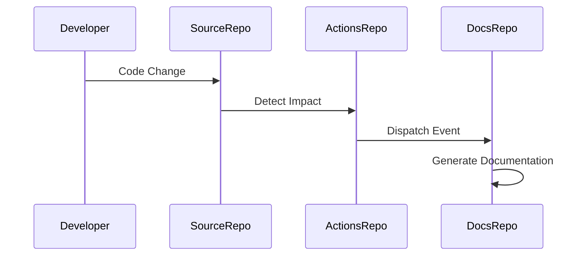

# Low-Level Design (LLD): greenfield-network

**Author**: Jijeesh Valappil
**Date**: 2026-07-12
**Version**: 1.0

**Source Repository**: `jijeeshlab/greenfield-code`
**Source PR Number**: `8`
**Source PR Title**: Update deploy.py

---

# 1. Introduction

## 1.1 Overview

This document describes the low-level implementation architecture generated from source code changes.

---

# 2. Detailed Design

## 2.1 Class Diagram

## 2.2 Sequence Diagram

## 2.3 Component Breakdown

### Source File: `src/deploy.py`

No functions detected.

---

# 3. Function Inventory

- To Be Determined (TBD)

---

# 4. Error Handling

- Input validation
- Logging
- Exception handling

---

# 5. Security Considerations

- GitHub Secrets used for authentication
- Token values must never be logged
- Review generated documentation before publication

---

# 6. Changed Files

- src/deploy.py

---

# 7. Open Questions

- Additional business rules required?
- Additional architectural requirements required?
