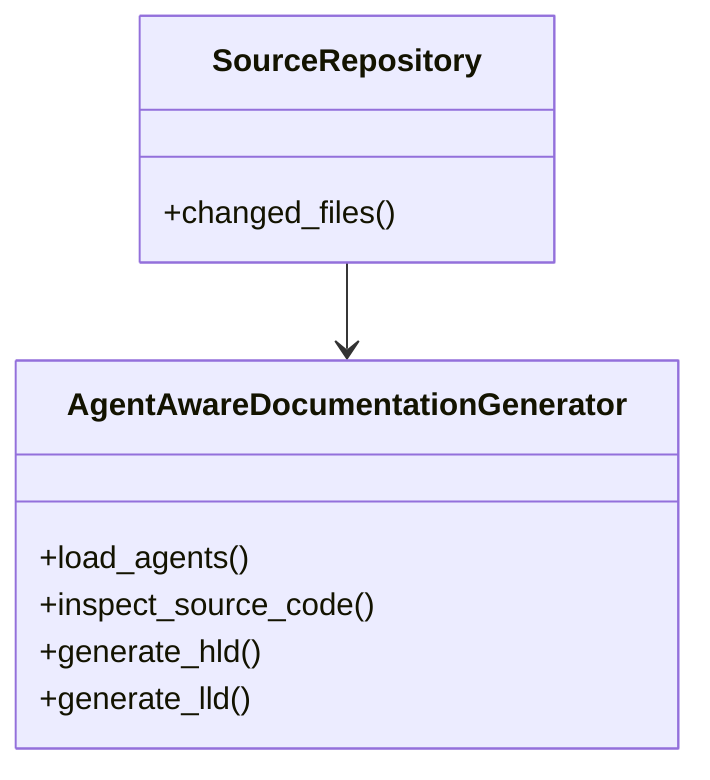
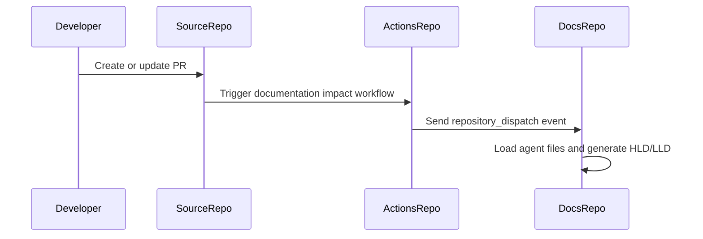

# Low-Level Design (LLD): greenfield-network

**Author**: Jijeesh Valappil
**Date**: 2026-07-13
**Version**: 1.0
**Related HLD**: docs/02-Architecture-and-Designs/01-High-Level-Designs/greenfield-network-hld.md

---

## Agent Context

| Agent File | Loaded |
|------------|--------|
| lld-agent.md | Yes |
| diagram-agent.md | Yes |

### LLD Agent Summary

# Low Level Design Agent ## Role You are a Solution Architect and Documentation Agent. Your task is to generate a complete Low-Level Design document based on: - Source code - Pull request details - Existing documentation - LLD template

---

## 1. Introduction

### 1.1. Overview

This document provides the low-level design for `greenfield-network` based on source code changes.

**Source Repository**: `jijeeshlab/greenfield-code`
**Source PR**: `12`
**Source PR Title**: Testing

---

## 2. Detailed Design

### 2.1. Class Diagram

### 2.2. Sequence Diagram

### 2.3. Component Breakdown

### Source File: `src/deploy.py`

**Parse Status:** `ast_success`

#### Function: `provision_zero_trust_network`

**Description:** Provisions zero trust network segmentation.

**Parameters:** cidr_block

**Returns:** dict

#### Function: `validate_network_segmentation`

**Description:** Validates network segmentation policies.

**Parameters:** segment_name

**Returns:** bool

#### Function: `deploy_application_load_balancer`

**Description:** Deploys application load balancer.

**Parameters:** load_balancer_name, vip_address

**Returns:** dict

#### Function: `deploy_private_dns_zone`

**Description:** Deploys private DNS services.

**Parameters:** zone_name

**Returns:** dict

#### Function: `deploy_vpn_gateway`

**Description:** Deploys VPN gateway service.

**Parameters:** gateway_name, public_ip

**Returns:** dict

#### Function: `deploy_storage_gateway`

**Description:** Deploys storage gateway service.

**Parameters:** gateway_name, storage_pool

**Returns:** dict

#### Function: `deploy_disaster_recovery_gateway`

**Description:** Deploys disaster recovery gateway services.

**Parameters:** gateway_name, recovery_site

**Returns:** dict

#### Function: `deploy_backup_replication_service`

**Description:** Deploys backup and replication services.

**Parameters:** policy_name, retention_days

**Returns:** dict

#### Function: `deploy_observability_stack`

**Description:** Deploys observability platform.

**Parameters:** stack_name, monitoring_enabled

**Returns:** dict

#### Function: `deploy_ai_observability_platform`

**Description:** Deploys AI observability and governance platform.

**Parameters:** platform_name

**Returns:** dict

#### Function: `deploy_kubernetes_cluster`

**Description:** Deploys Kubernetes cluster.

**Parameters:** cluster_name, worker_count

**Returns:** dict

#### Function: `deploy_ingress_controller`

**Description:** Deploys ingress controller.

**Parameters:** controller_name

**Returns:** dict

#### Function: `deploy_service_mesh`

**Description:** Deploys service mesh architecture.

**Parameters:** mesh_name

**Returns:** dict

#### Function: `deploy_api_gateway`

**Description:** Deploys API gateway platform.

**Parameters:** gateway_name

**Returns:** dict

#### Function: `deploy_secrets_management`

**Description:** Deploys secrets management service.

**Parameters:** vault_name

**Returns:** dict

#### Function: `deploy_zero_trust_access_policy`

**Description:** Deploys zero trust access policies.

**Parameters:** policy_name

**Returns:** dict

#### Function: `deploy_security_operations_platform`

**Description:** Deploys security operations platform.

**Parameters:** platform_name

**Returns:** dict

#### Function: `deploy_event_stream_platform`

**Description:** Deploys Kafka event streaming platform.

**Parameters:** cluster_name

**Returns:** dict

#### Function: `deploy_ai_gateway`

**Description:** Deploys AI gateway service.

**Parameters:** gateway_name, model_provider

**Returns:** dict

#### Function: `deploy_document_intelligence_service`

**Description:** Deploys document intelligence services.

**Parameters:** service_name

**Returns:** dict

#### Function: `deploy_model_serving_endpoint`

**Description:** Deploys AI model serving endpoint.

**Parameters:** endpoint_name, model_name

**Returns:** dict

#### Function: `deploy_prompt_management_service`

**Description:** Deploys prompt management services.

**Parameters:** service_name

**Returns:** dict

#### Function: `deploy_data_lakehouse`

**Description:** Deploys enterprise data lakehouse platform.

**Parameters:** storage_account, container_name

**Returns:** dict

#### Function: `deploy_stream_analytics_platform`

**Description:** Deploys streaming analytics platform.

**Parameters:** cluster_name

**Returns:** dict

#### Function: `deploy_vector_database`

**Description:** Deploys vector database service.

**Parameters:** database_name

**Returns:** dict

#### Function: `deploy_rag_platform`

**Description:** Deploys Retrieval Augmented Generation platform.

**Parameters:** vector_database, embedding_model

**Returns:** dict

---

## 3. Database Design

### 3.1. Database Schema

No database schema was detected in the changed source files.

| Table Name | Column Name | Data Type | Constraints | Description |
|------------|-------------|-----------|-------------|-------------|
| Not applicable | Not applicable | Not applicable | Not applicable | No database layer detected |

### 3.2. Data Access Layer

No dedicated data access layer was identified from the changed source files.

---

## 4. API Endpoint Specification

No API endpoint was detected in the changed source files.

---

## 5. Error Handling

- Validate input parameters before processing.
- Log operational events without exposing sensitive data.
- Return predictable status values.
- Avoid silent failures.

---

## 6. Security Considerations

- Validate all inputs.
- Do not log secrets, tokens, keys, passwords, or customer-sensitive identifiers.
- Use GitHub Secrets for automation credentials.
- Review generated documentation before publishing.

---

## 7. Unit Test Cases

- `provision_zero_trust_network()`
- `validate_network_segmentation()`
- `deploy_application_load_balancer()`
- `deploy_private_dns_zone()`
- `deploy_vpn_gateway()`
- `deploy_storage_gateway()`
- `deploy_disaster_recovery_gateway()`
- `deploy_backup_replication_service()`
- `deploy_observability_stack()`
- `deploy_ai_observability_platform()`
- `deploy_kubernetes_cluster()`
- `deploy_ingress_controller()`
- `deploy_service_mesh()`
- `deploy_api_gateway()`
- `deploy_secrets_management()`
- `deploy_zero_trust_access_policy()`
- `deploy_security_operations_platform()`
- `deploy_event_stream_platform()`
- `deploy_ai_gateway()`
- `deploy_document_intelligence_service()`
- `deploy_model_serving_endpoint()`
- `deploy_prompt_management_service()`
- `deploy_data_lakehouse()`
- `deploy_stream_analytics_platform()`
- `deploy_vector_database()`
- `deploy_rag_platform()`

---

## 8. Open Questions

- Should AI generation update only impacted sections instead of regenerating full documents?
- Should class and sequence diagrams be generated from code structure or architecture metadata?
- Should PR labels control whether documentation generation runs?

---

## Changed Files

- src/deploy.py
