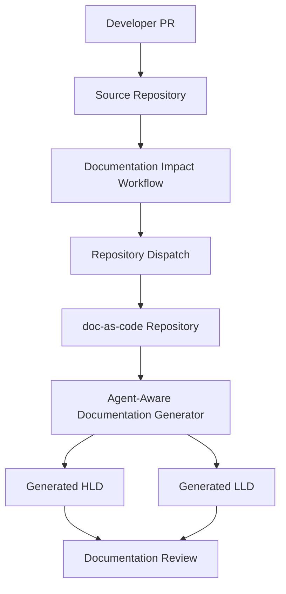
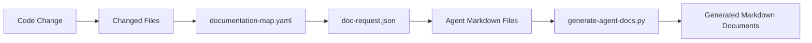

# High-Level Design (HLD): migration-platform

**Author**: Jijeesh Valappil
**Date**: 2026-07-13
**Version**: 1.0

---

## Agent Context

| Agent File | Loaded |
|------------|--------|
| impact-agent.md | Yes |
| hld-agent.md | Yes |
| diagram-agent.md | Yes |

### HLD Agent Summary

# High Level Design Agent ## Role You are an Enterprise Architect and Documentation Agent. Your responsibility is to generate a complete High-Level Design (HLD) document from: - Source code - Pull request information - Existing documentation - HLD template

---

## 1. Introduction

### 1.1. Overview

The greenfield network capability provides automated cloud network deployment, connectivity, DNS, gateway, and traffic management services.

This document was generated from source repository `jijeeshlab/brownfield-code` and pull request `1`.

**Source PR Title**: Update migrate.py

### 1.2. Scope

#### 1.2.1. In Scope

- `migrate_legacy_hardware_node()`

#### 1.2.2. Out of Scope

- Manual approval and final architecture sign-off.
- Runtime configuration not visible in the changed source files.
- Business requirements not represented by the source code.

### 1.3. Goals and Objectives

- Keep architecture documentation synchronized with source code changes.
- Reduce documentation drift.
- Provide reviewable HLD documentation through the Documentation-as-Code pipeline.
- Establish source-to-document traceability.

### 1.4. Acronyms and Abbreviations

| Term | Definition |
|------|------------|
| HLD | High-Level Design |
| LLD | Low-Level Design |
| PR | Pull Request |
| CI/CD | Continuous Integration and Continuous Deployment |
| Docs-as-Code | Documentation managed through Git, Markdown, pull requests, and automation |

---

## 2. Requirements

### 2.1. Functional Requirements

- `migrate_legacy_hardware_node()`

### 2.2. Non-Functional Requirements

- **Performance**: To Be Determined (TBD)
- **Scalability**: To Be Determined (TBD)
- **Availability/Reliability**: To Be Determined (TBD)
- **Security**: Generated documentation requires review before publication.
- **Maintainability**: Documentation must remain Markdown-based and reviewable.
- **Usability**: Documentation must be accessible through the MkDocs portal.

---

## 3. System Architecture

### 3.1. Architectural Diagram

### 3.2. System Components

- **src/migrate.py** (python, ast_success): Author: Jijeesh Valappil
Module: Brownfield Data Center Server Migration Core Utility

### 3.3. Technology Stack

- GitHub
- GitHub Actions
- Python
- Markdown
- MkDocs
- Mermaid

---

## 4. Data Flow and Storage

### 4.1. Data Flow Diagram

### 4.2. Data Model/Storage

Changed files used for this generation:

- src/migrate.py

---

## 5. Integration and APIs

### 5.1. External System Integrations

- Source code repository
- Central Actions repository
- Documentation template repository
- MkDocs documentation repository

### 5.2. API Strategy

GitHub repository dispatch is used to trigger documentation generation in the documentation repository.

---

## 6. Security and Compliance

- Repository tokens must be stored in GitHub Secrets.
- Generated documentation must be reviewed before merge.
- Secrets, keys, credentials, and customer-sensitive identifiers must not be copied into documentation.
- Automation must follow least privilege access principles.

---

## 7. Deployment and Operations

### 7.1. Deployment Strategy

Documentation is generated by GitHub Actions and committed to the MkDocs documentation repository.

### 7.2. Monitoring and Logging

- GitHub Actions logs provide workflow traceability.
- Pull request history provides review traceability.
- Generated files provide source-to-document linkage.

---

## 8. Risks and Assumptions

- Generated documentation may require manual correction.
- Business intent may not be fully represented by source code alone.
- Documentation quality depends on source code comments and function names.
- Human review remains mandatory before publication.

---

## 9. Open Questions

- Should generated content update existing sections instead of replacing the full document?
- Should real LLM-based generation be added after deterministic generation is stable?
- Should documentation updates require PR labels before generation?
