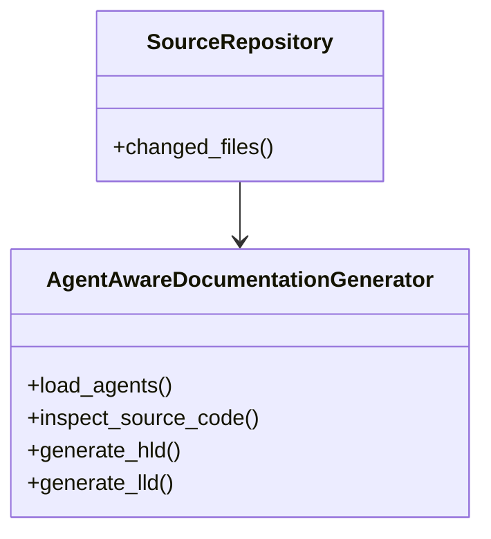
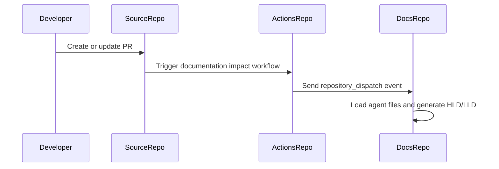

# Low-Level Design (LLD): migration-platform

**Author**: Jijeesh Valappil
**Date**: 2026-07-13
**Version**: 1.0
**Related HLD**: docs/08-Migrations-and-Projects/migration-platform-hld.md

---

## Agent Context

| Agent File | Loaded |
|------------|--------|
| lld-agent.md | Yes |
| diagram-agent.md | Yes |

### LLD Agent Summary

# Low Level Design Agent ## Role You are a Solution Architect and Documentation Agent. Your task is to generate a complete Low-Level Design document based on: - Source code - Pull request details - Existing documentation - LLD template

---

## 1. Introduction

### 1.1. Overview

This document provides the low-level design for `migration-platform` based on source code changes.

**Source Repository**: `jijeeshlab/brownfield-code`
**Source PR**: `2`
**Source PR Title**: Update migrate.py

---

## 2. Detailed Design

### 2.1. Class Diagram

### 2.2. Sequence Diagram

### 2.3. Component Breakdown

### Source File: `src/migrate.py`

**Parse Status:** `ast_success`

#### Function: `migrate_legacy_hardware_node`

**Description:** Manages secure workload evacuation protocols
during live system moves.

Args:
    server_id (str):
        Asset ID tracking code

    target_zone (str):
        Target data center destination

Returns:
    bool:
        True if migration preparation completed

**Parameters:** server_id, target_zone

**Returns:** bool

---

## 3. Database Design

### 3.1. Database Schema

No database schema was detected in the changed source files.

| Table Name | Column Name | Data Type | Constraints | Description |
|------------|-------------|-----------|-------------|-------------|
| Not applicable | Not applicable | Not applicable | Not applicable | No database layer detected |

### 3.2. Data Access Layer

No dedicated data access layer was identified from the changed source files.

---

## 4. API Endpoint Specification

No API endpoint was detected in the changed source files.

---

## 5. Error Handling

- Validate input parameters before processing.
- Log operational events without exposing sensitive data.
- Return predictable status values.
- Avoid silent failures.

---

## 6. Security Considerations

- Validate all inputs.
- Do not log secrets, tokens, keys, passwords, or customer-sensitive identifiers.
- Use GitHub Secrets for automation credentials.
- Review generated documentation before publishing.

---

## 7. Unit Test Cases

- `migrate_legacy_hardware_node()`

---

## 8. Open Questions

- Should AI generation update only impacted sections instead of regenerating full documents?
- Should class and sequence diagrams be generated from code structure or architecture metadata?
- Should PR labels control whether documentation generation runs?

---

## Changed Files

- src/migrate.py
