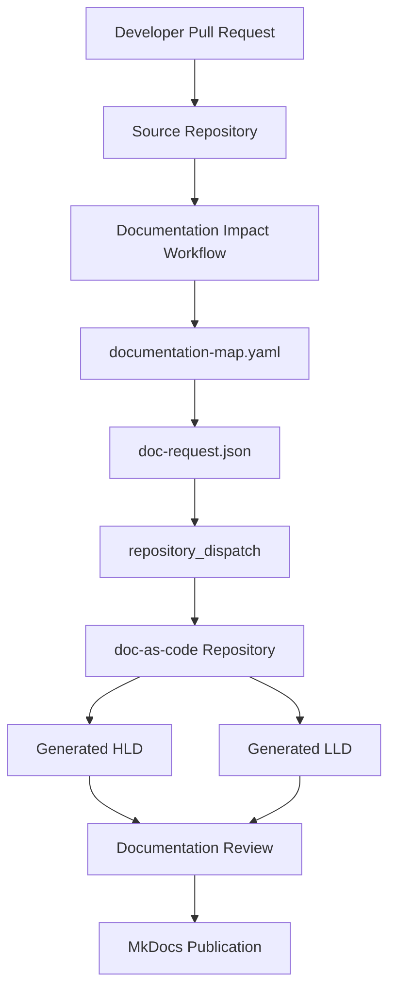

# Greenfield Network - HLD Architecture Diagram

```mermaid
graph TD

Developer[Developer Pull Request] --> SourceRepo[Source Repository]
SourceRepo --> ImpactWorkflow[Documentation Impact Workflow]
ImpactWorkflow --> DocMap[documentation-map.yaml]
DocMap --> DocRequest[doc-request.json]
DocRequest --> Dispatch[repository_dispatch]
Dispatch --> DocRepo[doc-as-code Repository]
DocRepo --> HLD[Generated HLD]
DocRepo --> LLD[Generated LLD]
HLD --> Review[Documentation Review]
LLD --> Review
Review --> Publish[MkDocs Publication]

```

## Description

The diagram above represents the automated documentation generation flow for the service **Greenfield Network**.
